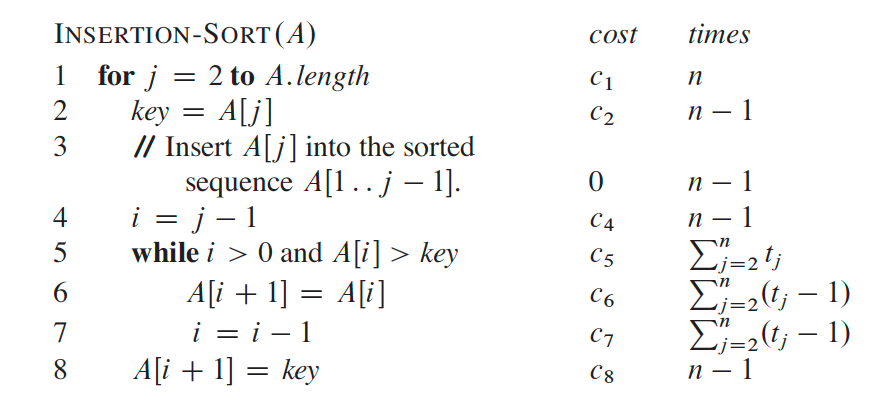

# CISC/CMPE 365 — Lecture 2: Algorithm Complexity (slides)

> Source: `L02 AlgorithmComplexity.pdf` (Yuanzhu Chen, 2026-09-10), kept beside this note.
> Covers CLRS ch. 2 — see the companion summary
> [`../summaries/unit02-getting-started-summary.md`](../summaries/unit02-getting-started-summary.md).

## TLDR

Correctness first, then efficiency. Insertion sort is the worked example: count each line's cost ×
how many times it runs, take the **worst case** as the default, then throw away constants and
lower-order terms to get the **order of growth**.

## Algorithm correctness

> A **correct** algorithm: for **every** input instance, it halts with the correct output. We then
> say the algorithm *solves* the computational problem.

Given two correct algorithms for the same problem, choose on:

- ease of understanding
- elegance
- **efficiency** (space and time)

Problems differ in requirement too: sometimes **only the best solution will do**, sometimes an
**approximately best** solution is good enough.

## Why efficiency matters

Sorting 10 million numbers:

| | Insertion sort — (n^2)$ | Merge sort — (n \lg n)$ |
|---|---|---|
| Machine | 10 **billion** instr/sec | 10 **million** instr/sec |
| Work | $(10^7)^2$ instructions | $10^7 \lg 10^7$ instructions |
| Time | **20,000 s** (> 5.5 hours) | **1160 s** (< 20 min) |

The machine running merge sort is **1000× slower** and still wins by about 17×. Same comparison as
CLRS §1.2, already in [`../summaries/unit01-role-of-algorithms-summary.md`](../summaries/unit01-role-of-algorithms-summary.md).

## Insertion sort and its cost model



```
INSERTION-SORT(A)                                  cost   times
1  for j = 2 to A.length                           c1     n
2      key = A[j]                                  c2     n-1
3      // Insert A[j] into the sorted              0      n-1
          sequence A[1 .. j-1].
4      i = j - 1                                   c4     n-1
5      while i > 0 and A[i] > key                  c5     sum_{j=2..n} t_j
6          A[i+1] = A[i]                           c6     sum_{j=2..n} (t_j - 1)
7          i = i - 1                               c7     sum_{j=2..n} (t_j - 1)
8      A[i+1] = key                                c8     n-1
```

The slide notes: **the index of list $A$ runs from 1 to `A.length`**, not from 0.

> ⚠️ **Notation clash with the filed textbook.** This deck uses the **CLRS 3rd-edition** form —
> `INSERTION-SORT(A)`, outer loop index **$j$**, inner index **$i$**. The CLRS **4th edition** we
> have filed uses `INSERTION-SORT(A, n)` with outer **$i$** and inner **$j$** — the two indices
> are **swapped**. Follow the professor's convention in tests, but expect the letters to flip when
> you read [`../references/clrs-4e/05-2-getting-started.md`](../references/clrs-4e/05-2-getting-started.md).

$t_j$ = the number of times the `while` test on line 5 runs for that $j$.

- **Best case** (already sorted): the `while` test fails immediately, $t_j = 1$ → linear,
  $\Theta(n)$.
- **Worst case** (reverse sorted): $t_j = j$, the scan walks the whole prefix → quadratic,
  $\Theta(n^2)$.

## Best vs. worst case — which to use?

The slides give two reasons for defaulting to **worst case**:

1. It is an **upper bound** on the running time for *any* input.
2. The worst case **occurs fairly often**.

## Order of growth

| | Exact | Drop constants | Order of growth |
|---|---|---|---|
| $T_1(n) = 20n + 5$ | → $20n$ | → $n$ | $\Theta(n)$ |
| $T_2(n) = 4n + 50$ | → $4n$ | → $n$ | $\Theta(n)$ |
| $T_3(n) = n^2 + n$ | → $n^2$ | → $n^2$ | $\Theta(n^2)$ |
| $T_4(n) = 2n^2 + 50$ | → $2n^2$ | → $n^2$ | $\Theta(n^2)$ |

<!-- The PDF text layer renders these superscripts as "n!" (e.g. "T3(n) is in Θ(n!)").
     That is an extraction artifact for n^2, not something on the slide. -->

## Analyzing computational complexity — the rules

- **Sequence of statements** → the complexity of the *most complex* statement in it.
- **Loop** → complexity of the loop body × number of times the loop executes.
- **Conditional** → the complexity of whichever branch is *higher*.

### How exactly

1. Identify the **fundamental step** executed most often.
2. Write a function relating how often that step executes to the **input size**.
3. Simplify by discarding smaller terms and constant coefficients.
4. What remains is the complexity.
