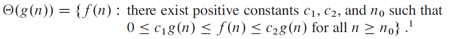
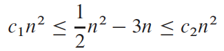
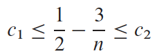
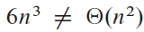
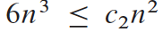
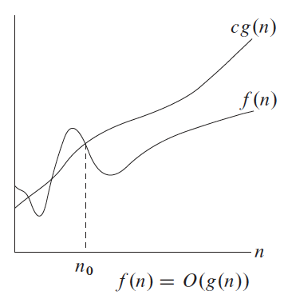
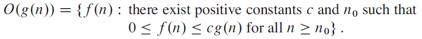
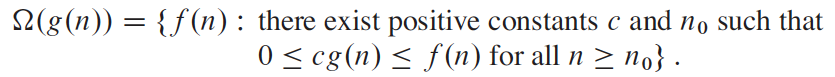

# CISC/CMPE 365 — Lecture 3: Asymptotic Notations (slides)

> Source: `L03 AsymptoticNotations.pdf` (Yuanzhu Chen), kept beside this note.
> **Companion:** Gabe's own notes from this lecture are
> [`2026-09-14-lecture03-asymptotic-notation.md`](2026-09-14-lecture03-asymptotic-notation.md).
> The formal definitions are **images** in the slide deck, so they are transcribed to LaTeX below —
> the original images are linked beside each one.

## TLDR

Three bounds, each a *set* of functions: $O$ caps from above, $\Omega$ floors from below, $\Theta$
clamps both. $\Theta$ needs two constants; $O$ and $\Omega$ need one. Then the algebra of using
them inside equations, plus transitivity / reflexivity / symmetry.

## Why asymptotic notation

- Characterize an algorithm's efficiency — to **compare** alternatives and to **identify the
  bottleneck**.
- Consider input size increasing **without bound** (asymptotic) because inputs can be large in
  reality.
- The asymptotically more efficient algorithm is the better choice, **except for very small
  inputs**.

## Order of running time growth

$$T_1(n) = 3n^3 - n^2 + 2 = \Theta(n^3) \qquad T_2(n) = 50n^2 + 10 = \Theta(n^2)$$

- The lower-order terms **and coefficients** become insignificant.
- What remains is the order of growth of the running time.

## $\Theta$-notation — asymptotically tight bound

$$\Theta(g(n)) = \{\, f(n) : \text{there exist \textbf{positive constants} } c_1, c_2, n_0
\text{ such that } 0 \le c_1 g(n) \le f(n) \le c_2 g(n) \text{ for all } n \ge n_0 \,\}$$

Written either way — $f(n) \in \Theta(g(n))$ or $f(n) = \Theta(g(n))$.

> Note the slide says **"positive constants"** — real numbers, not integers. Constants like
> $c_1 = 1/5$ are entirely normal.

### Worked example

$$\tfrac{1}{2}n^2 - 3n = \Theta(n^2)$$

$$c_1 n^2 \le \tfrac{1}{2}n^2 - 3n \le c_2 n^2$$

Dividing through by $n^2$:

$$c_1 \le \tfrac{1}{2} - \tfrac{3}{n} \le c_2$$

**The slides stop here — they leave the inequality in terms of $n$ and do not substitute a value.**
Picking $n_0$ is the step that pins the constants: since $\tfrac{1}{2} - \tfrac{3}{n}$ *increases*
toward $\tfrac12$, taking $n_0 = 10$ gives $c_1 = \tfrac15$, while $c_2$ must clear the limit, so
$c_2 = \tfrac12$. See the flag in the companion note — this is exactly where the hand-written
notes went wrong.

### Counterexample

$$6n^3 \ne \Theta(n^2)$$

because $6n^3 \le c_2 n^2$ would force $6n \le c_2$, and no constant bounds $n$ for all large $n$.

## $O$-notation — upper bound

$$O(g(n)) = \{\, f(n) : \text{there exist positive constants } c, n_0
\text{ such that } 0 \le f(n) \le c\,g(n) \text{ for all } n \ge n_0 \,\}$$

> If $f(n) = \Theta(g(n))$, does it imply $f(n) = O(g(n))$?  **Yes** — $\Theta(g(n)) \subseteq O(g(n))$.

- If $O$-notation bounds the **worst-case** running time of an algorithm, it bounds the running
  time on **every** input.

## $\Omega$-notation — lower bound

$$\Omega(g(n)) = \{\, f(n) : \text{there exist positive constants } c, n_0
\text{ such that } 0 \le c\,g(n) \le f(n) \text{ for all } n \ge n_0 \,\}$$

### Theorem (general quadratic)

$$an^2 + bn + c = \Theta(n^2), \qquad an^2 + bn + c = O(n^2), \qquad an^2 + bn + c = \Omega(n^2)$$

The $\tfrac12 n^2 - 3n$ example above is the case $a = \tfrac12$, $b = -3$, $c = 0$.

## Practice — are these correct?

Posed on the slides, answers not shown. Work them before the Sep 24 test.

| | Claim | |
|---|---|---|
| 1 | $n + 1 = \Theta(n)$ | |
| 2 | $n + 1 = O(n)$ | |
| 3 | $n + 1 = O(n^2)$ | |
| 4 | $n + 1 = \Omega(n)$ | |
| 5 | $n + 1 = \Omega(n^2)$ | |
| 6 | $n + 1 = \Omega(1)$ | |

And for insertion sort:

1. The running time is in $\Omega(n)$
2. The running time is in $O(n^2)$
3. The running time is in $\Omega(n^2)$
4. The running time is in $\Theta(n)$
5. The running time is in $\Theta(n^2)$
6. The **best-case** running time is in $\Theta(n)$
7. The **worst-case** running time is in $\Theta(n^2)$

> The distinction being drilled: an unqualified "the running time" of insertion sort has no single
> $\Theta$, because best and worst case differ. $O$ and $\Omega$ statements about it can still be
> true.

## Asymptotic notation inside equations

$$2n^2 + 3n + 1 = 2n^2 + \Theta(n)$$

means $2n^2 + 3n + 1 = 2n^2 + f(n)$ where $f(n) \in \Theta(n)$. Using notation this way "can help
eliminate inessential detail and clutter in an equation."

$$2n^2 + \Theta(n) = \Theta(n^2)$$

means: for any $f(n) \in \Theta(n)$, there is some $g(n) \in \Theta(n^2)$ with
$2n^2 + f(n) = g(n)$. Chaining them:

$$2n^2 + 3n + 1 = 2n^2 + \Theta(n) = \Theta(n^2)$$

> Read these left-to-right only. The `=` is not symmetric here — that is what the symmetry rule
> below is about.

## Properties

**Transitivity** — holds for all three:

$$f = \Theta(g) \text{ and } g = \Theta(h) \implies f = \Theta(h)$$
$$f = O(g) \text{ and } g = O(h) \implies f = O(h)$$
$$f = \Omega(g) \text{ and } g = \Omega(h) \implies f = \Omega(h)$$

**Reflexivity:** $f(n) = \Theta(f(n))$, $f(n) = O(f(n))$, $f(n) = \Omega(f(n))$.

**Symmetry:**

$$f(n) = \Theta(g(n)) \iff g(n) = \Theta(f(n))$$
$$f(n) = O(g(n)) \iff g(n) = \Omega(f(n))$$

The second is the useful one: **$O$ and $\Omega$ are duals** — swapping the arguments flips the
notation. Only $\Theta$ is genuinely symmetric.

## Reading

CLRS **Chapter 3: Characterizing Running Times** —
[`../references/clrs-4e/06-3-characterizing-running-times.md`](../references/clrs-4e/06-3-characterizing-running-times.md)
