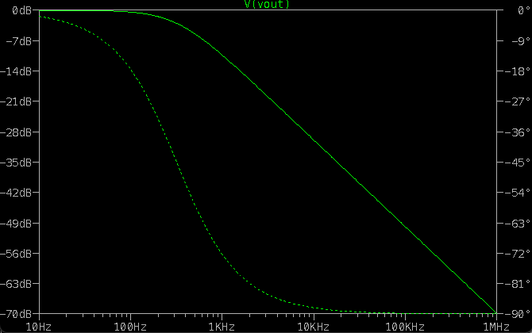
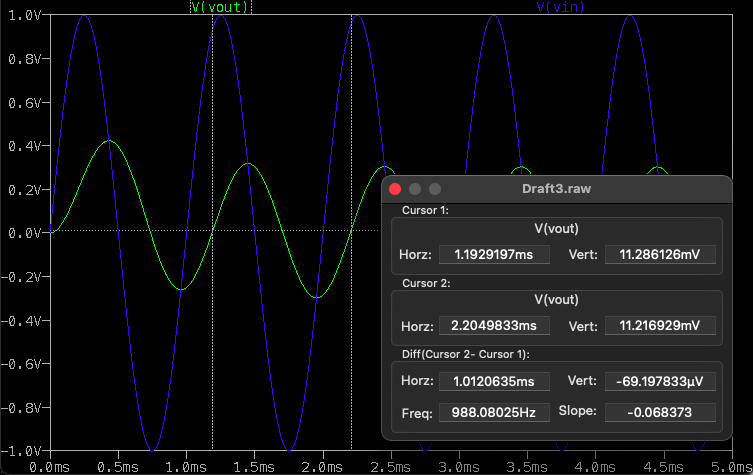

# ENPH 334 / PHYS 334 — Lab A0 Sim: Introduction to Electronic Simulation

> Source: `ENPH334LabA0_Sim3.pdf` (lab manual, "Updated Sept. 2022"). Filed source PDF:
> [`ps00-lab-a0-ltspice-simulation.pdf`](./ps00-lab-a0-ltspice-simulation.pdf)
> Companion slides: [`../lectures/2023-09-12-lecture00-lab-a0-intro-slides.md`](../lectures/2023-09-12-lecture00-lab-a0-intro-slides.md)

## TLDR

Three deliverable **Tasks**, one per SPICE analysis type, all on trivially small circuits — the
point is the tool, not the theory:

1. **Part 1 (`.op`, DC operating point):** find the Thevenin equivalent of a resistor network by
   simulating it twice — once with a 10 MΩ "open" load (gives $V_{Th}$), once with the real 750 Ω
   load — and back out $R_{Th}$.
2. **Part 2 (`.tran`, transient):** an RC low-pass with $R = 5\ \text{k}\Omega$,
   $C = 100\ \text{nF}$, driven at 1 kHz. Measure gain and phase from the waveforms and compare to
   $A_v = 1/\sqrt{1+(\omega RC)^2}$ and $\phi_{th} = -\arctan(\omega RC)$.
3. **Part 3 (`.ac`, AC sweep):** same circuit, 10 Hz → 10 MHz. Find the −3 dB cutoff and the phase
   there; compare to $f_c = 1/(2\pi RC)$ and $\phi = -\arctan(2\pi f_c RC)$.

The theory in Parts 2 and 3 is covered in the **Week 2A course notes** — the lab manual says so
explicitly, so this lab runs slightly ahead of lecture.

---

## Background

LTspice is a circuit simulator built on **SPICE** (Simulation Program with Integrated Circuit
Emphasis), an open-source simulation engine. Other variants exist — HSPICE, PSPICE — but they all
use a similar underlying algorithm. (The manual notes the SPICE algorithm itself isn't tested in
this course, just useful to understand.)

LTspice is free and available for Windows, macOS, and Linux. **The macOS version is significantly
different** — menus are laid out differently and options are harder to find, though the capability
is the same. These lab instructions are written for Windows/Linux, so the lab computers are
recommended. *(Relevant for you specifically, since you're on macOS — expect to translate the menu
paths, or just use the lab machines.)*

The three simulation types covered:

| Directive | Name | What it computes |
|---|---|---|
| `.op` | Operating point | The **DC voltages at all nodes** of the circuit |
| `.tran` | Time domain (transient) | Circuit conditions over a user-set time window, e.g. $V_{in}(t)$ and $V_{out}(t)$ of an AC circuit |
| `.ac` | Frequency domain (AC sweep) | Circuit behaviour across a range of source frequencies (e.g. 10 Hz → 1 MHz); produces linear or logarithmic plots of the **transfer function** |

## Part 1 — DC circuit analysis (`.op`)

Draw and save the schematic above. Setup notes:

- Set the load resistor **R5 to 10 MΩ** initially instead of its real value of **750 Ω** (enter as
  `10e6` or `10Meg`). This stands in for an open circuit at the load, which is necessary because
  **the simulator will not accept open loops or nets** — every node needs a DC path.
- Resistors and the ground symbol are on the top menu bar, but a voltage source must be placed via
  the generic **"Component"** button (listed as either "voltage" or "battery").
- `Ctrl-R` rotates a component before placing it; right-click a placed component to edit parameters.
- **Don't forget the circuit ground** — SPICE needs a node 0 reference.

Run the simulation, choose the **operating point** simulation on the right-most tab, and accept.
The raw output lists every current and voltage but is hard to map to nodes. Fix this by adding a
**net label** called `Vout` at the node between **R4 and R5** (using "Label Net", beside the ground
button), then re-run.

With the 10 MΩ load, the voltage at `Vout` is effectively the open-circuit output, i.e. the
**Thevenin voltage** $V_{Th}$.

Then restore the load to its original **750 Ω** and repeat, recording the voltage and current
levels.

> **Task 1:** Using this simulation, determine the Thevenin resistance $R_{Th}$ for the circuit,
> knowing the load voltage and $V_{Th}$. Explain the process of calculating the Thevenin resistance
> and voltage using the simulation.

**The method** (the manual leaves this for you to derive): with the load $R_L = 750\ \Omega$
attached, the source network behaves as an ideal source $V_{Th}$ behind a series resistance
$R_{Th}$, so the measured load voltage is a voltage divider:

$$V_L = V_{Th}\,\frac{R_L}{R_{Th} + R_L} \quad\Longrightarrow\quad R_{Th} = R_L\left(\frac{V_{Th}}{V_L} - 1\right)$$

Equivalently, from the load current $I_L$: $R_{Th} = (V_{Th} - V_L)/I_L$.

**Exact answer for this circuit** (worked from the component values in the schematic — use it to
check your simulation). $V_1$ is an ideal 10 V source, so $R_3$ draws current but does not affect
anything downstream. With the load removed, no current flows through $R_4$, so $V_{out}$ equals
the $R_1$–$R_2$ divider voltage:

$$V_{Th} = 10\,\frac{R_2}{R_1+R_2} = 10\,\frac{500}{500+500} = 5\ \text{V}$$

Killing the source (shorting $V_1$) puts $R_1 \parallel R_2$ in series with $R_4$:

$$R_{Th} = (R_1 \parallel R_2) + R_4 = \frac{500 \cdot 500}{500+500} + 500 = 250 + 500 = 750\ \Omega$$

Note $R_{Th} = R_5 = 750\ \Omega$ exactly — the lab is built as a **matched load**, so
reattaching the 750 Ω load must give precisely half the Thevenin voltage:

$$V_L = V_{Th}\,\frac{750}{750+750} = 2.5\ \text{V}$$

If your `.op` run gives $\approx 5$ V open-circuit and $\approx 2.5$ V loaded, the schematic is
right. Feeding those back through the formula closes the loop:
$R_{Th} = 750\left(\tfrac{5}{2.5} - 1\right) = 750\ \Omega$.

## Part 2 — Time domain (transient) analysis (`.tran`)

Start a new circuit and draw the schematic above — a series RC with the output taken across the
capacitor, i.e. an **RC low-pass**. Components:

- $R_1 = 5\ \text{k}\Omega$ (enter `5000` or `5k`)
- $C_1 = 100\ \text{nF} = 0.1\ \mu\text{F}$ (enter `100n` or `0.1u`)
- $V_1$: place the "voltage" component, right-click → **"Advanced options"** → **SINE** function.
  Set **DC offset 0, amplitude 1, frequency 1k**.

Run a **transient** simulation with a **5 ms stop time**. Probe `Vout` and `Vin` by clicking on the
circuit — two sine waves should appear.

**Expected result (use as a correctness check):** there is a decaying transient in the output. The
peak positive amplitude starts around **0.42 V** and decays to about **0.3 V by 2.5 ms**. Click the
coloured trace title to bring up cursors for measuring that trace.

Since the transient dies out in about 2.5 ms, examine steady state by either zooming into 3 ms–5 ms,
or right-clicking the `.tran` SPICE directive text and setting **"start saving data after" 3 ms**,
then re-running.

**Measuring phase difference $\phi$:**

1. With cursors, measure $\Delta t$, the time between the input and output traces crossing 0 V —
   **using like points** (both upward crossings or both downward crossings).
2. Measure the period $T$ of the input trace.
3. Then

$$\phi = \frac{\Delta t}{T}\,360^\circ$$

Record both the measured phase and the theoretical phase:

$$\phi_{th} = -\arctan(\omega RC), \qquad \omega = 2\pi f, \qquad f = 1000\ \text{Hz}$$

Also measure the **gain** $A_V = V_{out}/V_{in}$ as the ratio of peak values, and compare to

$$A_v = \frac{1}{\sqrt{1 + (\omega RC)^2}}$$

> **Task 2:** Show the process of calculating the phase and gain of the circuit, both theoretically
> and using the simulation results.

## Part 3 — AC sweep analysis (`.ac`)

Set up a new circuit and redraw the Part 2 circuit, but change the analysis type to AC.

- **Before** changing the simulation type: right-click the voltage source, find **"Small Signal
  parameters"**, and set **AC Amplitude = 1**. (Without this the AC analysis has no excitation and
  the plot is empty — a classic first-time LTspice trap.)
- Run an **AC analysis** from **10 Hz to 10 MHz**, at **5 points per decade**.

The output plots, on the same graph, (a) the **gain in decibels** and (b) the **phase angle in
degrees** of the output with respect to the input — i.e. a Bode plot.

Measure with the cursors:

- **Cutoff frequency $f_c$** — the frequency where the gain is **−3 dB**
- **Phase angle $\phi$ at that $f_c$**

Compare with the theoretical values:

$$f_c = \frac{1}{2\pi RC}, \qquad \phi = -\arctan(2\pi f_c RC)$$

> **Task 3:** Using the simulated graphs, show the process of calculating the simulated and
> theoretical cutoff frequency and phase.

## Appendix 1 — Use of the probe cursors

- To place the **first cursor**, **left-click** the graph label at the top of the desired graph.
- To place a **second cursor**, **double-click** the same label.
- Drag the cursors by their crosshairs; the cursor number appears when hovering over the correct
  part of the cursor.
- Measured values appear in the pop-up window.

---

## Worked numerical check (derived here, not in the manual)

Useful to have precomputed before walking into the lab — if the simulator disagrees with these, the
schematic is wrong, not the theory.

With $R = 5\ \text{k}\Omega$ and $C = 100\ \text{nF}$, the time constant is

$$\tau = RC = (5\times 10^{3})(100\times 10^{-9}) = 5\times 10^{-4}\ \text{s} = 0.5\ \text{ms}$$

which is why the startup transient is essentially gone by $\sim 2.5\ \text{ms} = 5\tau$, exactly as
the manual predicts.

**Part 2, at $f = 1\ \text{kHz}$:**

$$\omega RC = 2\pi(1000)(5\times 10^{-4}) = \pi \approx 3.1416$$

$$A_v = \frac{1}{\sqrt{1+\pi^2}} = \frac{1}{\sqrt{10.87}} \approx 0.303$$

With a 1 V input amplitude this predicts a steady-state output amplitude of about **0.30 V** —
matching the manual's stated "decays to about 0.3 V by 2.5 ms". 

$$\phi_{th} = -\arctan(\pi) \approx -72.3^\circ$$

**Part 3:**

$$f_c = \frac{1}{2\pi RC} = \frac{1}{2\pi(5\times 10^{-4})} \approx 318.3\ \text{Hz}$$

and at $f = f_c$, $2\pi f_c RC = 1$, so

$$\phi = -\arctan(1) = -45^\circ$$

This is the general result for any single-pole RC low-pass: **the −3 dB point is always where the
phase shift is exactly −45°**, because both conditions are $\omega RC = 1$. Note that 1 kHz (Part 2)
sits about 1.65 octaves above $f_c$, which is why the phase there has already rolled most of the way
toward its −90° asymptote.

## Links to course material

- **Thevenin's theorem** (Part 1) and **AC/phasor analysis** (Parts 2–3) are the two prerequisites
  the 2026 lab overview flags as "particularly important for the first two labs" — see
  [`../lectures/2026-09-08-lecture00-lab-overview.md`](../lectures/2026-09-08-lecture00-lab-overview.md).
- The manual notes the Part 2/3 formulae are derived in the **Week 2A course notes**, which haven't
  been filed yet.
