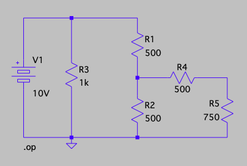
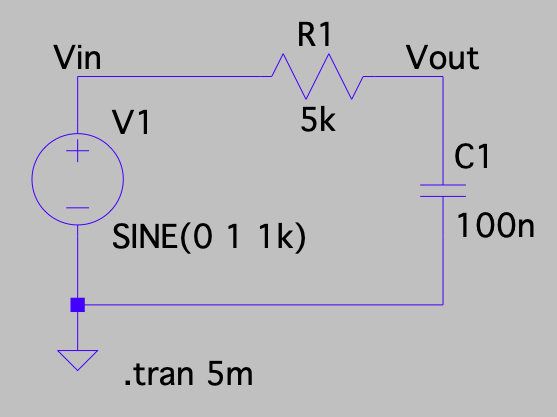

# ENPH 334 / PHYS 334 — Lab A0 Prelab Calculations

> **All theoretical calculations for Lab A0's three tasks, worked in full**, ready to copy into
> your lab notebook per [`00-lab-book-marking-and-debugging.md`](00-lab-book-marking-and-debugging.md)
> ("circuit diagrams with component values should be prepared *before* the lab" — this is that
> prep). Companion to the full lab walkthrough,
> [`lab-a0-ltspice-simulation.md`](lab-a0-ltspice-simulation.md), which has the LTspice mechanics
> (menu paths, probe cursors, setup gotchas) that this file deliberately leaves out.
>
> **What this can't do:** the actual simulation. Every task also asks you to compare theory against
> *simulated* results — that half only exists once you've run LTspice. What follows is the
> **theoretical half**, computed in advance so you have numbers to check the simulator against
> the moment you have them, rather than working blind.

## TLDR

| Task | Quantity | Theoretical result |
|---|---|---|
| 1 | Thevenin voltage / resistance | $V_{Th} = 5\ \text{V}$, $R_{Th} = 750\ \Omega$ |
| 1 | Loaded voltage / current (750 Ω load) | $V_L = 2.5\ \text{V}$, $I_L = 3.33\ \text{mA}$ |
| 2 | Gain / phase at $f = 1\ \text{kHz}$ | $A_v = 0.303$ ($-10.36\ \text{dB}$), $\phi = -72.3°$ |
| 3 | Cutoff frequency / phase there | $f_c = 318.3\ \text{Hz}$, $\phi(f_c) = -45°$ |

---

## Task 1 — Thevenin equivalent (Part 1, `.op`)

$$V_1 = 10\ \text{V}, \quad R_1 = R_2 = R_4 = 500\ \Omega, \quad R_3 = 1\ \text{k}\Omega, \quad R_5 (\text{load}) = 750\ \Omega$$

### Step 1 — find $V_{Th}$: remove the load, find the open-circuit voltage

With $R_5$ disconnected (the 10 MΩ stand-in in the sim), **no current can flow through $R_4$** —
one end of it dead-ends at the open terminal. With zero current through $R_4$, it drops zero
voltage, so the output node sits at exactly the voltage of the node between $R_1$ and $R_2$.

$R_3$ is irrelevant to this voltage: it sits directly across the *ideal* source $V_1$, which holds
its terminal voltage fixed regardless of how much current $R_3$ draws. So $R_3$ only affects how
hard the source works — it does not affect the $R_1$–$R_2$ divider at all.

That leaves a plain voltage divider across $R_1$ and $R_2$:

$$V_{Th} = V_1 \cdot \frac{R_2}{R_1 + R_2} = 10 \cdot \frac{500}{500+500} = \boxed{5\ \text{V}}$$

### Step 2 — find $R_{Th}$: kill the source, find the resistance looking back into the terminals

"Kill" an ideal voltage source by replacing it with a short (0 V). With $V_1$ shorted, its top
terminal is tied directly to ground, so:

- $R_3$ now sits between ground and ground on both ends — shorted out, contributes nothing.
- $R_1$ becomes a plain 500 Ω from ground up to the middle node.
- $R_2$ is still 500 Ω from the middle node to ground.

So $R_1$ and $R_2$ are now **in parallel** with each other (both run from the middle node to
ground), and that combination is in series with $R_4$ on the way out to the output terminal:

$$R_{Th} = (R_1 \parallel R_2) + R_4 = \frac{R_1 R_2}{R_1+R_2} + R_4 = \frac{500 \cdot 500}{1000} + 500 = 250 + 500 = \boxed{750\ \Omega}$$

> 🔑 Note $R_{Th} = R_5 = 750\ \Omega$ **exactly** — this circuit is built as a matched load on
> purpose (see the consequence below).

### Step 3 — predict the loaded measurement (for the 750 Ω run)

With the real 750 Ω load reattached, the circuit is just $V_{Th}$ behind $R_{Th}$, feeding $R_L$ —
a voltage divider one more time:

$$V_L = V_{Th}\cdot\frac{R_L}{R_{Th}+R_L} = 5\cdot\frac{750}{750+750} = \boxed{2.5\ \text{V}}$$

Since $R_{Th} = R_L$, this is a matched load, so $V_L$ is **exactly half** of $V_{Th}$ — a clean
sanity check with no arithmetic needed once you've confirmed $R_{Th}=R_L$.

$$I_L = \frac{V_L}{R_L} = \frac{2.5}{750} = \boxed{3.33\ \text{mA}}$$

### Step 4 — the formula to invert simulator readings back into $R_{Th}$

This is the part the manual actually asks for: given only the two **measured** voltages (open and
loaded), recover $R_{Th}$ without already knowing the circuit's internal resistor values. Starting
from the loaded-voltage-divider relation and solving for $R_{Th}$:

$$V_L = V_{Th}\frac{R_L}{R_{Th}+R_L} \quad\Longrightarrow\quad R_{Th} = R_L\left(\frac{V_{Th}}{V_L}-1\right)$$

Equivalently, from the loaded current $I_L = V_L/R_L$:

$$R_{Th} = \frac{V_{Th}-V_L}{I_L}$$

**This is the formula to actually use once you have your two simulated voltages** — plug in your
measured $V_{Th}$ (open-circuit run) and $V_L$ (loaded run) here. If your schematic matches the one
above, it should return $R_{Th}\approx 750\ \Omega$ and confirm Step 2.

---

## Task 2 — RC low-pass gain and phase at $f=1\ \text{kHz}$ (Part 2, `.tran`)

$$R = 5\ \text{k}\Omega, \qquad C = 100\ \text{nF}, \qquad f = 1000\ \text{Hz} \ (\text{sine, amplitude } 1\ \text{V})$$

### Deriving $A_v$ and $\phi$ from the phasor voltage divider

$V_{out}$ is taken **across the capacitor**, so this is a voltage divider in the frequency domain
between the resistor's impedance $R$ and the capacitor's impedance $Z_C = \dfrac{1}{j\omega C}$:

$$H(j\omega) = \frac{V_{out}}{V_{in}} = \frac{Z_C}{R+Z_C} = \frac{1/(j\omega C)}{R + 1/(j\omega C)}$$

Multiply numerator and denominator by $j\omega C$ to clear the fractions:

$$H(j\omega) = \frac{1}{1+j\omega RC}$$

This single complex-valued transfer function contains both the gain (magnitude) and phase (angle):

$$A_v = |H(j\omega)| = \frac{1}{\sqrt{1+(\omega RC)^2}} \qquad\qquad \phi = \angle H(j\omega) = -\arctan(\omega RC)$$

(The magnitude of a quotient is the quotient of magnitudes, and $|1| = 1$ while
$|1+j\omega RC| = \sqrt{1+(\omega RC)^2}$; the angle of a quotient is the difference of angles, and
$\angle 1 = 0$ while $\angle(1+j\omega RC) = \arctan(\omega RC)$, so the overall angle is the
negative of that.)

### Evaluating at $f = 1\ \text{kHz}$

$$\omega RC = 2\pi f RC = 2\pi(1000)(5\times10^3)(100\times10^{-9}) = 2\pi(1000)(5\times10^{-4}) = \pi \approx 3.1416$$

*(a clean result — $2\pi \times 1000 \times 5\times10^{-4} = 2\pi \times 0.5 = \pi$ exactly)*

$$A_v = \frac{1}{\sqrt{1+\pi^2}} = \frac{1}{\sqrt{10.87}} = \boxed{0.303}$$

With a 1 V input amplitude, this predicts a **steady-state output amplitude of $\approx 0.30$ V** —
matches the lab manual's own statement that the transient decays to "about 0.3 V by 2.5 ms."

In decibels (for cross-checking against Part 3's dB-scaled plot later):

$$A_{v,\text{dB}} = 20\log_{10}(0.303) = \boxed{-10.36\ \text{dB}}$$

$$\phi = -\arctan(\pi) = \boxed{-72.3°}$$

### Where to look for these in the simulation

- **Gain**: ratio of the peak values of the $V_{out}$ and $V_{in}$ traces, read off with cursors,
  **after** the transient has died out (start saving data after 3 ms, or zoom to the 3–5 ms window).
- **Phase**: $\phi = (\Delta t / T)\times 360°$, where $\Delta t$ is the time between the input and
  output traces crossing zero **at like points** (both rising, or both falling — not one of each),
  and $T$ is the input period ($T = 1/f = 1\ \text{ms}$ here).

---

## Task 3 — cutoff frequency and phase (Part 3, `.ac`)

Same RC low-pass as Task 2, swept from 10 Hz to 10 MHz.

### Deriving $f_c$ from the $-3$ dB condition

The cutoff (half-power) frequency is *defined* as where the output power drops to half its
low-frequency value — equivalently, where the voltage gain drops to $1/\sqrt2$ of its maximum
(unity, here, since $A_v \to 1$ as $\omega \to 0$). Set $A_v(\omega_c) = 1/\sqrt2$ and solve:

$$\frac{1}{\sqrt{1+(\omega_c RC)^2}} = \frac{1}{\sqrt2} \ \Longrightarrow\ 1+(\omega_c RC)^2 = 2 \ \Longrightarrow\ (\omega_c RC)^2 = 1 \ \Longrightarrow\ \omega_c RC = 1$$

$$\boxed{f_c = \frac{\omega_c}{2\pi} = \frac{1}{2\pi RC}}$$

*(Sanity check on the name: $20\log_{10}(1/\sqrt2) = -3.01\ \text{dB}$ — this is exactly where
"$-3$ dB point" comes from.)*

### Evaluating

$$f_c = \frac{1}{2\pi RC} = \frac{1}{2\pi(5\times10^3)(100\times10^{-9})} = \frac{1}{2\pi(5\times10^{-4})} = \boxed{318.3\ \text{Hz}}$$

### Phase at cutoff — a general fact, not just this circuit

At $\omega = \omega_c$, by construction $\omega_c RC = 1$, so:

$$\phi(f_c) = -\arctan(\omega_c RC) = -\arctan(1) = \boxed{-45°}$$

**This holds for *any* single-pole RC low-pass**, regardless of the specific $R$ and $C$ values —
the $-3$ dB point and the $-45°$ phase point are the *same* frequency, because both conditions
reduce to $\omega RC = 1$. Worth remembering as a standing fact, not something to re-derive each
lab.

> 🔑 **Cross-check against Task 2.** $f=1\ \text{kHz}$ sits $\log_2(1000/318.3) \approx 1.65$
> **octaves** above $f_c$ — consistent with its phase ($-72.3°$) having already swung most of the
> way from $-45°$ toward the $-90°$ high-frequency asymptote, rather than sitting close to $-45°$.
> If your simulated phase at 1 kHz came out near $-45°$ instead, that's a sign $f_c$ or the circuit
> values are off, not that the theory is wrong.

---

## What to bring into the lab

- These three boxed-result pairs, to compare live against each `.op`/`.tran`/`.ac` run.
- The derivations above, in your own notebook, **before** you wire anything — per the marking
  scheme, calculations done in advance are what the "prepare ahead of time" mark is checking for.
- The two circuit diagrams (reproduced above) with every component value labelled, ready to compare
  against what you actually draw in LTspice.
