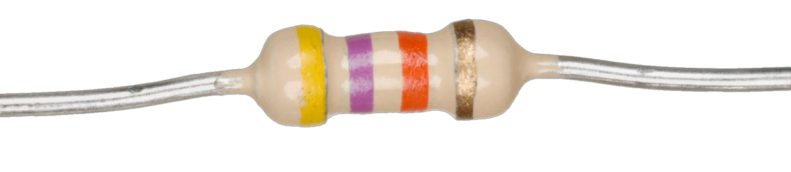
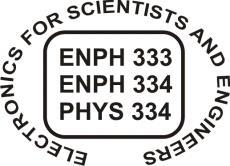
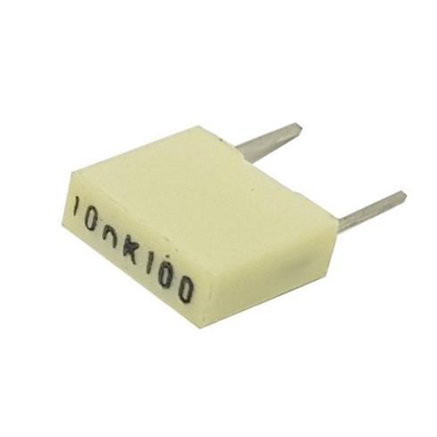
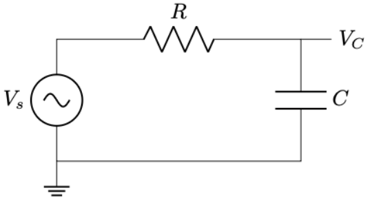
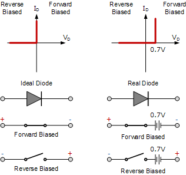
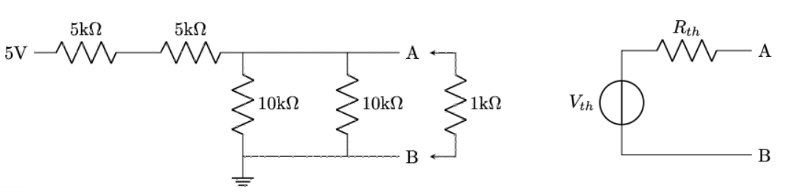
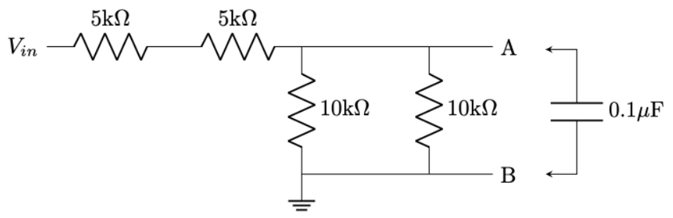
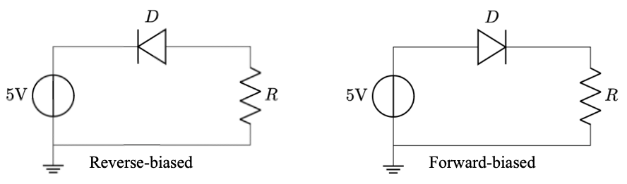
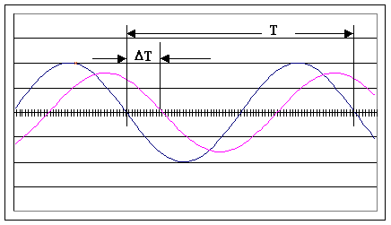

# ENPH 334 / PHYS 334 — Lab A1: Resistors, Capacitors, and Diodes

> **Week 3 lab (from 21 Sep 2026)**, run in Stirling 404/405 in your registered section, in fixed
> pairs. Source: `lab-a1-resistors-capacitors-diodes.pdf`, **revised September 2024** — a manual
> carried over from a previous offering, so cross-check any equipment or software detail against
> the current [syllabus](../references/syllabus-f2026.md).
>
> 🖼 **Nine figures extracted** to `assets/lab-a1-resistors-capacitors-diodes/` and linked inline
> below. Some schematics inside the manual are vector drawings that did not extract — where a
> "Figure N" caption appears with no image under it, open the PDF at that point.
>
> 📝 The results tables in Appendix 3 are headed **"PHYS 333-334"**, and appear twice each — an
> artifact of how the tables are laid out in the source. They are the ENPH 334 tables.

## TLDR

Three parts, all on the bench. **Part A** builds a resistive network, measures its **Thévenin
equivalent** with both a multimeter and an oscilloscope, and compares against calculation.
**Part B** turns it into a **Thévenin RC circuit** and finds the **−3 dB point** and the
**phase shift** between $V_S$ and $V_C$ — using the *Thévenin* $R_T$, not the raw resistor, in the
$f_{3dB}$ calculation. **Part C** takes forward and reverse **I–V characteristics for a silicon
diode and an LED**.

The manual states plainly that "the types of measurements you made in this experiment are typical
of the measurements you might be asked to make during the **hands-on laboratory test at the end of
the term**" — so treat this as lab-test preparation, not a one-off.

**Prerequisites from the notes:** Thévenin reduction (see
[`../problem-sets/ps02-...-solutions.md`](../problem-sets/ps02-week1-class-problems-thevenin-superposition-solutions.md),
including the successive-reduction technique) and complex impedance / phasors
([`../problem-sets/ps01-...`](../problem-sets/ps01-week1-problems-dc-fundamentals.md) Q5).
Lab A0 simulated the same RC low-pass in LTspice — see
[`lab-a0-ltspice-simulation.md`](lab-a0-ltspice-simulation.md).

## The three Tasks

The deliverables are the numbered **Tasks**, checked off individually by a TA during the session:

1. **Part A** — show the process of measuring the Thévenin voltage using the multimeter with the
   resistors, then show the same process using the oscilloscope.
2. **Part B** — show how to measure the gain and phase, and how you determined the −3 dB point.
3. **Part C** — explain the results you obtained for each of the diodes.

Record everything per [`00-lab-book-marking-and-debugging.md`](00-lab-book-marking-and-debugging.md)
— circuit diagrams with component values **and pin numbers, drawn before wiring**.

---

NOTE

The purpose of this experiment is to familiarize you with some of the equipment you will be using in the lab and to remind you of some of the circuit characteristics of passive circuit components. You should record the results of your measurements in an or ganized fashion in your lab book and also make notes about how the effects of the various controls on the instruments you used. The types of measurements you made in this experiment are typical of the measurements you might be asked to make during the hands-on laboratory test at the end of the term.

INTRODUCTION

This lab is intended to review a few basic circuit concepts and to familiarize you with the equipment in the lab bench. See Appendix 2 for a review of the types of lab equipment you will be using. A resistive circuit and a series R -C circuit are tested, using the Th évenin equivalent circuit, and characteristics are obtained for diodes and LEDs (Light -Emitting Diodes).

A. Resistors

Resistors are the most common component in the electronics lab. These are components with the ideal property that the current through the circuit element is proportional to the voltage across the element.

Δ𝑉 = 𝑅𝐼

Actual discrete components are either colour coded, or have the value marked on the component itself (including a manufacturing tolerance on the value). See Fig. 1 for examples.

Figure 1. Resistor with band example. Image from wikipedia.

ENPH 334 PHYS 334 First digit Second digit Multiplier Tolerance R = 47*10^3 Ohms = 47kOhms ± 5%

A very useful theorem, due to Thevenin, allows combinations of resistors and voltage supplies to be replaced by a single equivalent voltage supply and a single equivalent resistor. This makes it much simpler to consider the effects of connecting other components to the original set of resistors and supplies.

B. Capacitors

Capacitors are essentially conducting sheets or plates separated by an insulating material called a dielectric. There are many types of capacitors defined by the materials and structure used for the electrodes and the dielectric (metal film, aluminum electrolytic, ceramic, etc.). We will primarily use metal film capacitors in these labs.

Figure 2: A metal film capacitor. Image source.

The capacitance is defined as the charge per unit voltage:

𝐶 = 𝑄 Δ𝑉,

Where C is the capacitance in Farads, Q is the charge on the capacitor in Coulombs, and ∆V is the voltage drop across the capacitor in Volts.

In addition, we can determine the accumulated charge based on the current flow using:

𝑄 = 𝐼Δ𝑡,

where I is the current in amps, and Δ𝑡 is the time in seconds.

Referring to the Week 1/2 course notes, the above equations may be manipulated to give:

𝐶Δ𝑉 = 𝐼Δ𝑡 𝐼 = 𝐶 𝑑𝑉 𝑑𝑡

When a sine wave voltage is applied to the capacitor, it can be shown that the capacitor exhibits an "impedance", ZC, analogous to resistance in DC circuits, given by

𝑍𝐶 = 1 𝑠𝐶 = 1 𝑗𝜔𝐶 = 1 𝑗2𝜋𝑓𝐶

where 𝑠 ≡ 𝑗𝜔 ≡ 𝑗2𝜋𝑓, and j is the complex unit √−1 that you might have encountered in other classes. It's just a convention in electronics and some other engineering disciplines that j is used instead of i.

Ohm's law applies to AC circuits just like is does for DC circuits, except we use complexvalued impedances instead of real-valued resistances. For the R-C series circuit shown in Fig. 3, we can solve the system using impedance instead of solving a differential equation.

Figure 3. RC Circuit 𝑉𝐶 = 𝑍𝐶 𝑅 + 𝑍𝐶 𝑉𝑆 = 1 𝑠𝐶 𝑅 + 1 𝑠𝐶 𝑉𝑠 = 1 1 + 𝑠𝐶𝑅 𝑉𝑠 These equations return complex numbers and to extract physical measurables we calculate the modulus |𝑍| = √𝑥2 + 𝑦2 to get the amplitude (note: is it only the amplitude?) and the argument 𝜃 = −arctan ( 𝑦 𝑥) to get the phase difference between the input and output.

|𝑉𝐶| = 𝑉𝑠 √1 + (2𝜋𝑓𝐶𝑅)2

𝜃 = −arctan (2𝜋𝑓𝐶𝑅)

A specific point of interest in such circuits is the so -called " –3 dB point", which is the frequency at which the gain of the circuit in decibels, 20 log ( |𝑉𝑐| |𝑉𝑠|), is equal to −3dB, or 1 √2 = 0.7071 in linear units. Working through the math, we can see that this occurs when ωCR = 1.

C. Diodes A diode consists of two semiconducting materials in atomic contact with one another and has the property of allowing current to flow easily in one direction but not the other.

Figure 4: Ideal vs. Real Diodes. Image source. When a diode is conducting, the anode is more positive than the cathode and we say the diode is "forward-biased". When a diode is forward -biased, the voltage across it does not change significantly as the current changes, and the voltage has a value that i s characteristic of the material from which the diode is made. This behaviour can be modelled like an ideal voltage source in series with a small resistance, as shown in Fig. 4 (this figure omits the small resistance).

When the voltage is applied in the opposite direction (the cathode is more positive than the anode), we say the diode is "reverse-biased". In this situation, the diode can be modelled as a very-large valued resistor (Fig. 4 shows an open circuit, but there will be some small current that passes through). The value of this large resistance will again depend on the material the diode is made from.

EXPERIMENTAL WORK

A. Resistors

Measurements: Construct the circuit shown on the left in Fig. 5 on the breadboard (without the 1 k test resistor). Assume that the 5-volt source on the board is ideal and calculate the Thevenin equivalent source voltage V TH and source resistance R TH as shown to the right in Fig 5. VTH is the voltage between A and B without the test resistor connected. RTH is obtained by calculating the resistance between the points A and B with all independent voltage supplies short-circuited.

Connect the 1k  test resistor across AB and confirm that the measured voltage across the 1k resistor matches the voltage calculated using the Thevenin equivalent circuit with the 1 k resistor as the load. Use the multimeter to take the measurements up to this point.

Disconnect the 5V supply and replace it with a 3Vpp, 1 kHz sinusoidal signal from the signal generator. Repeat the measurements and comment on the possible reasons for any differences between the calculated and measured values.

Place your results in an appropriate Table (see Appendix 3 for an example).

Figure 5. Thevenin Equivalent Circuit Task: show the process of measuring the Thevenin voltage using the multimeter using the resistors. Then show the same process but using the oscilloscope.

B. Capacitors

Figure 6: Thevenin RC Circuit

Measurements: Replace the 1 k test resistor used in the previous section with a 0.1 µF metal film capacitor as shown in Fig. 6. Calculate the expected value of the –3 dB frequency for the R-C circuit, using the value of RTH as the value of R.

Confirm the value of the –3 dB frequency by measuring the amplitude of voltage across the capacitor at low frequency, and then increasing the frequency until the amplitude of the voltage is 3 dB less than it was at low frequency.

Measure the phase difference between the signal generator voltage (VS) and VC when f = f3 dB and when f &gt;&gt; f3 dB. Appendix 1 describes how to use the oscilloscope to measure the phase difference between two sinusoidal signals.

Place your results in a table.

Task: show how to measure the gain and phase, and how you determined the -3dB point.

C. Diodes

Figure 7: Reverse-biased and forward-biased diodes.

Measurements: Connect the anode of a 1N914 silicon diode (or a 1N4002 diode) in series with a resistor, R, of approximately 500  to the 5-volt supply and its cathode (indicated with a black band or light -coloured band) to ground. Measure value of the resistor, the voltage

across the diode and across the series resistor R, and record the values in the table below. The forward current flowing in the circuit can be determined using Ohm's law from the voltage across R i.e. ID = VR/R.

Reverse the diode and repeat the measurements.

Change the resistor to a value around 200  and repeat the measurements (forward and reverse), recording the values in the table.

Repeat the measurements for a light-emitting diode (LED), again recording measurements in the table. (The cathode on the LED is indicated by a flat portion on the rim of the plastic shell.) These diodes are fabricated from GaAs and the characteristic voltage across them when they are conducting is significantly different from that of silicon diodes.

For each type of diode, plot I D vs Vdiode for the forward measurements. Then determine the characteristic forward-biased voltage drop, Vchar, for both Si and GaAs diodes by extrapolating the two points for each diode to find the horizontal intercept on the Vdiode axis.

Compare the measured values of Vchar with the typical values (Storey 4th ed, Sect. 16.6)

You will also find values for the typical forward voltages of different coloured LEDs on Wikpedia, and also at www.kpsec.freeuk.com/components/led.htm. Check these out in the lab, and note in your lab book.

Task: Explain the results you obtained for each of the diodes.

Appendix 1 Measuring phase shift using an oscilloscope

When measuring the phase shift between two signals using an oscilloscope you must have the horizontal sweep mode switch set to "chop" rather than "alt" (which stands for alternate). If you are not sure of the difference between these two settings please ask in the lab.

The diagram above shows the best way to set up the scope to make the most accurate measurement of phase difference.

First, adjust the vertical position of both beams to the centre of the screen with the vertical amplifier coupling switch in the ground position. Next, set the vertical amplifier coupling switch for both inputs to the ac position.

Adjust the timebase so that approximately one cycle of the waveform appears on the screen. You can then adjust the variable control and the x position control on the timebase so that the zero crossings of one waveform lie exactly on one of the major x -axis divisions marked on the scope screen.

With the scope set in this fashion you know that the number of divisions on the screen represented by the interval T corresponds to 360 o. Therefore, the phase difference between the two signals, which is represented by the interval T, is equal to:

Phase difference = 360() degrees

Appendix 2 Review of basic lab equipment

The most important pieces of equipment are 1) the oscilloscope, 2) the digital multimeter, 3) the signal generator, and 4) the circuit breadboard.

The breadboard allows components to be interconnected temporarily without using solder. Integrated circuit chips can be placed across the channels and each pin on the chip is then connected to the five adjacent holes. The long strips along the sides have all their holes connected along their lengths (except for some boards which have a break in the middle).

The boards have integral power supplies of +15 volts, -15 volts and + 5 volts. They also have two BNC connectors to allow external signals to be brought to the board. The boards are fairly rugged; perhaps the biggest source of damage to them is over-heating caused by short-circuiting the power supplies. The best way to avoid this problem is to use a colour code for the supply connections. This will also help you to troubleshoot a circuit if it doesn't work the first time. Use red wire for the +15 volt supply and use the right-hand longitudinal strip for connections. Use black wire for the ground connection and use the center strip to make connections. Use green wire to the extreme left-hand longitudinal strip for the -15 volt supply.

The signal generator provides three basic signal shapes; sine wave, square wave, and triangular wave. It also supplies a pulse output of + 5 volts which will be used in the digital experiments later in the term. The standard signals are adjustable in frequency and amplitude. The generator also has the facility for adding a dc voltage to any of the generated signals (dc offset). This offset should be zero unless it is specifically required.

The digital multimeter allows the measurement of ac or dc voltage or current as well as resistance. Its most important feature is that it has a very high input impedance, i.e. it draws very little current from the circuit under test. In operation, always check that the multimeter is set to measure the correct physical quantity (volts, amps or ohms) before connecting the probes.

The oscilloscope is the major measuring instrument in the lab. There are several different models in the lab each of which has a slightly different layout of controls, but they all have basically the same set of controls. The oscilloscope sweeps a beam of electrons at a constant rate along the x-axis while an electrical signal is applied to a set of vertical deflection plates. The resulting display shows the time evolution of the signal. It is useful for displaying the shape of any repetitive waveform.

• The speed with which the beam moves from left to right on the screen is controlled by an internal circuit called a timebase which is adjustable over a wide range using a switch.

• There are two independent inputs (dual-trace) which control the vertical motion of the electron beam across the screen. The size of the vertical displacement of the beam as it sweeps across on the screen is adjusted by two independent vertical amplifiers.

The oscilloscope displays repetitive signals. For the display on the screen to appear stable (stationary), the beam must start on the left side of the screen at the identical point in the signal each time it sweeps across the screen. The trigger controls determine when the sweep starts. The controls allow the user to select at what voltage (level) the signal must be and whether the signal is increasing or decreasing (slope) at the instant that the sweep starts. There is an additional control which allows selection of the source of the signal to be used for triggering.

If anything here is not clear, confusing or plainly does not make sense: ask a TA!

Appendix 3 – Suggested Tables of Results

PHYS 333-334 Lab A1 Part A VS = _________V Thevenin Circuit Measurements RT (Ω) VT (volts) VAB (volts) calculated measured calculated measured dc acPHYS 333-334 Lab A1 Part A VS = _________V Thevenin Circuit Measurements RT (Ω) VT (volts) VAB (volts) calculated measured calculated measured dc ac PHYS 333-334 Lab A1 Part B f3dB Measurements Note: In RC circuit, use Thevenin value RT for f3dB calculation. VT = Thevenin voltage f3dB calculated = _________ Hz VS (Funct.Gen.Volts) = _________ V f &lt;&lt; f3dB (~50 Hz) VC (~VT) = _________ V xxxxx VC = 0.707(VC(50Hz)) f3dB measured = _________ Hz f &gt;&gt; f3dB (~5 kHz) xxxxx xxxxx xxxxx Phase Angle (Deg.) bet. VC and VS ___________ deg ___________ degPHYS 333-334 Lab A1 Part B f3dB Measurements Note: In RC circuit, use Thevenin value RT for f3dB calculation. VT = Thevenin voltage f3dB calculated = _________ Hz VS (Funct.Gen.Volts) = _________ V f &lt;" f3dB (~50 Hz) VC (~VT) " _________ V xxxxx VC = 0.707(VC(50Hz)) f3dB measured = _________ Hz f &gt;&gt; f3dB (~5 kHz) xxxxx xxxxx xxxxx Phase Angle (Deg.) bet. VC and VS ___________ deg ___________ deg PHYS 333-334 Lab A1 Part C Diode Measurements ~500 Ω 200 Ω R = __________ Ω R = __________ Ω Vchar (calc Vdiode VR ID=VR/R (calc) Vdiode VR ID=VR/R (calc) or meas.) Silicon (Si) forward reverse xxxxx LED (GaAs) forward reverse xxxxxPHYS 333-334 Lab A1 Part C Diode Measurements ~500 Ω 200 Ω R = __________ Ω R = __________ Ω Vchar (calc Vdiode VR ID=VR/R (calc) Vdiode VR ID=VR/R (calc) or meas.) Silicon (Si) forward reverse xxxxx LED (GaAs) forward reverse xxxxx
