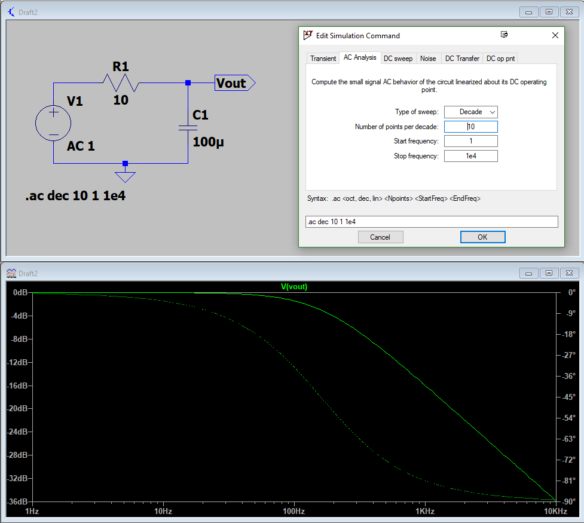

# ENPH 334 — Lab Introduction + Lab A0 Slides (prior-year deck)

> Source: `334_A0_Slides.pdf`. Filed source PDF:
> [`2023-09-12-lecture00-lab-a0-intro-slides.pdf`](./2023-09-12-lecture00-lab-a0-intro-slides.pdf)
>
> **⚠️ This is an older version of the lab-intro deck.** The PDF was authored **2023-09-12** and
> lists a 2023 teaching team; the file has been dated by its own content date rather than by when
> you downloaded it, so it sorts before the current-term material. The **current** deck is
> [`2026-09-08-lecture00-lab-overview.md`](./2026-09-08-lecture00-lab-overview.md) — **where the
> two conflict, trust the 2026 one.** Conflicts are listed at the bottom of this note.
>
> It is kept because the LTspice slide and the lab rules are still the operative content for
> Lab A0.

## Teaching team (2023 — superseded)

- **TAs:** Hector Hawley Herrera, Hugh Morison, Nayem Al Kayed, Fraser McCaully
  <!-- unclear: "McCaully" here vs. "Fraser McCauley" in the 2026 deck — almost certainly the same person, spelling differs between the two decks -->
- **Quizzes/exams:** Zhimu Guo
- **Electronics technician:** Mark Evans

## Lab rules

- **No food or liquids inside the lab at any time.** Leave water or any liquid-containing flasks
  outside, in your bags, or at the sink. Step outside to eat or drink.
- **Return all borrowed parts** to their corresponding bins at the end of the session.
- **Blown fuses and broken (burnt) parts go in the trash bin** — "or if you have enough by the end
  of the semester, make a necklace."
- **If you break benchtop equipment it is automatically charged to your SOLUS account.** Tell a TA
  what the problem is and they will get a replacement ASAP.

## Objectives of the lab

- Learn the practical and technical skills behind **designing and constructing a circuit**:
  simulation, prototyping, testing, debugging.
- Proper handling and use of a **multimeter, signal generator, and oscilloscope** — "the bread and
  butter of an electronics engineer."
- **Present data in a way that maximizes the utility** of the plot or numbers.
- Introduction to **research skills** for developing and designing a circuit from scratch.
- Building and sustaining the habit of **writing a lab notebook**.
- "Blow as many fuses as possible!"

## How the labs work, week by week (2023 version — partly superseded)

- You must complete **all the Tasks** in your lab report.
- **Attendance is only recorded once all tasks have been reviewed by a TA** — it is your
  responsibility to get checked off.
- Raise your hand once a task is complete. **Task review is when TAs give feedback and correct
  misconceptions**, so ask questions there.
- If many hands are up, move on and raise your hand again when it's calmer.
- If a lab wasn't finished on time: finish it next week, or in off-hours — **off-hours means no TA
  supervision**; email a TA or Mark Evans for access.
- Later in the semester there are **extra TA-supported hours** to catch up missed weeks.
- ~~"There are no deliverables at the end of the week. The goal is the lab completion mark."~~
  **See conflict note below — this is no longer true in 2026.**

## Lab A0 — Introduction to Simulation Tools (LTspice)

Three relevant types of simulation (the same three the Lab A0 manual walks through):

1. **DC Operating Point** simulation
2. **Transient (time-domain)** simulation
3. **AC Sweep (frequency-domain)** simulation

Why LTspice in this course:

- **2023 was the first year switching over from OrCAD.**
- LTspice is **free and multi-platform**.
- **Simulation only — no PCB design capability.**
- **Simpler** than the alternatives.

Full walkthrough of all three analyses:
[`../problem-sets/ps00-lab-a0-ltspice-simulation.md`](../problem-sets/ps00-lab-a0-ltspice-simulation.md).

---

## ⚠️ Conflicts with the 2026 deck

Flagged rather than silently overwritten, per repo convention:

| Point | This deck (2023) | 2026 deck — authoritative |
|---|---|---|
| **Weekly deliverables** | "There is no deliverables at the end of the week. The goal is the lab completion mark." | Lab **notebook** submitted end of Week 4 (feedback) and Week 11 (graded); **two design projects** with formal reports and presentations (Week 8 analog, Week 11 digital); **end-of-term lab test**. |
| **Teaching team** | TAs Hawley Herrera, Morison, Al Kayed, McCaully; Zhimu Guo on quizzes/exams; Mark Evans technician | Instructor **Dr. Bhavin Shastri**; TA **Arpan Sur** (quizzes/exam); lab TAs **Fraser McCauley, Sam Lamontagne, Ammar Ibrahim, Cameron Ingo** |
| **Make-up policy** | Generic "extra hours later in the semester" | Specific options incl. attending another section by prior email, and a dedicated **Week 7** extra session |
| **LTspice framing** | "First year switching over from OrCAD" | No longer new — LTspice is simply the course tool |
| **Lab location** | Not stated | **Stirling 405** |

The **rules**, **objectives**, **check-off mechanics**, and the **LTspice content** are consistent
across both decks.
