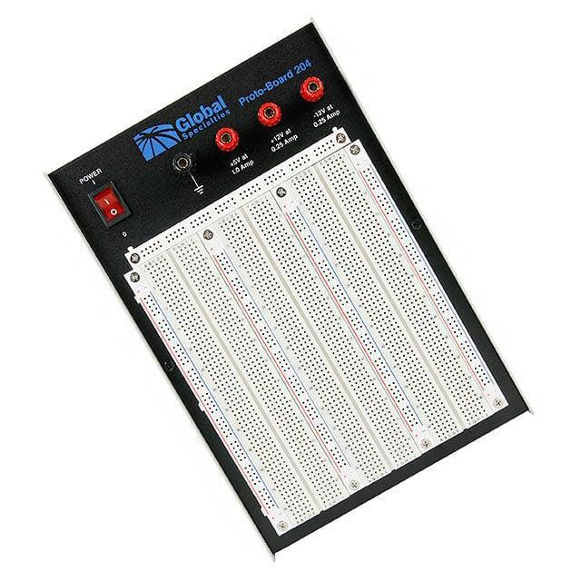
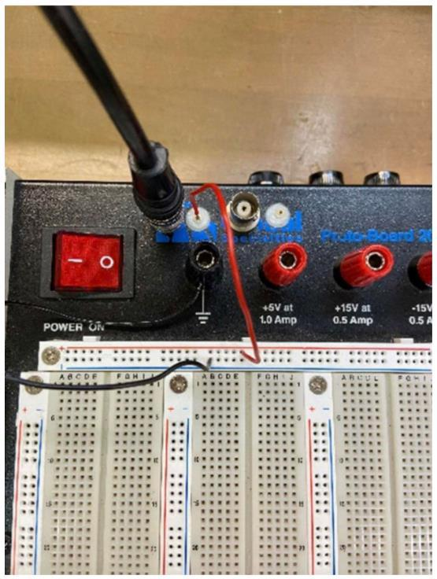
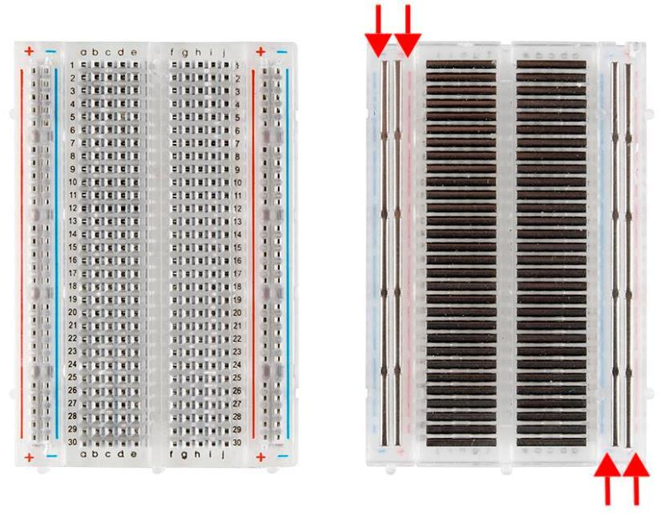
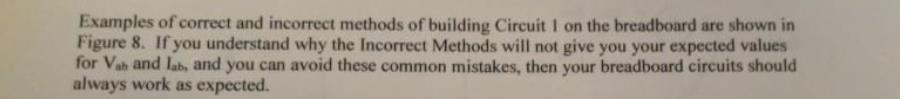
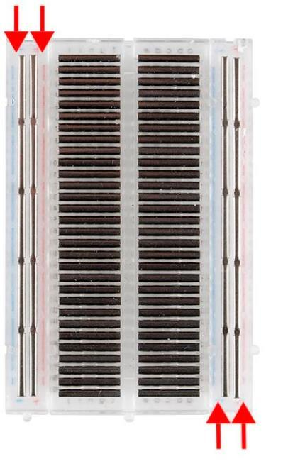
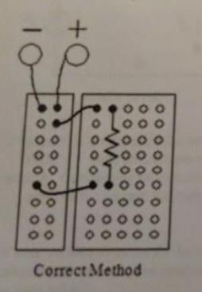
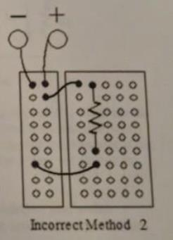
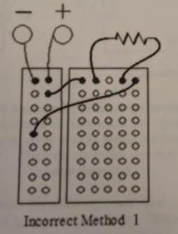
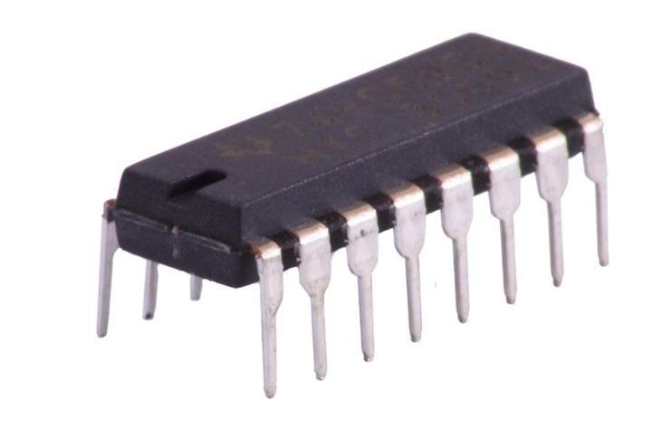
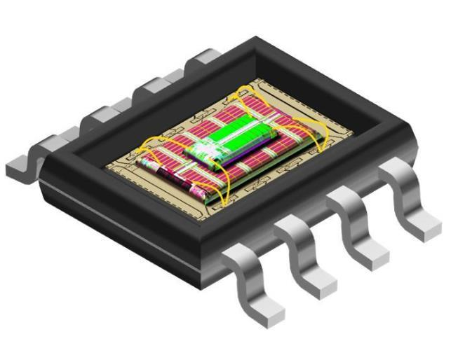

# ENPH 334 — Lab Overview (September 2026)

> Source: `Lab intro slides 2026.pdf` (Fraser McCauley, lab coordinator). Filed source PDF:
> [`2026-09-08-lecture00-lab-overview.pdf`](./2026-09-08-lecture00-lab-overview.pdf)

## TLDR

- **Teaching team:** Dr. Bhavin Shastri (lectures, course admin); Arpan Sur (quizzes, exam);
  lab TAs Fraser McCauley, Sam Lamontagne, Ammar Ibrahim, Cameron Ingo.
- **Labs are worth 36%** across notebook + design project components, and **you get zero on both
  unless every weekly lab is completed and checked off.** Completion grading is binary.
- Four assessed components: **weekly completion**, **lab notebook** (feedback at Week 4, graded at
  Week 11), **two design projects** (analog Week 8, digital Week 11), **end-of-term lab test**.
- Labs are in **Stirling 405**, in pairs formed at the first lab.
- **This week:** read the syllabus, install LTspice, read the Lab A0 manual, and review Thevenin's
  theorem + AC/phasor analysis. Week 1 readings: **Storey chapters 3–6**.

---

## Goals of the lab component

**Main goal — learn the equipment:**

| Instrument | What it does |
|---|---|
| Breadboard | Build and test circuits with no soldering |
| Function generator | Create AC waveforms to send through your circuit |
| Multimeter | Measure voltage, current, resistance, and more |
| Oscilloscope | Measure voltage as a function of time |

Framing used in the slides: *measurements are mediated by electronics* — the instrument is part of
the circuit, not a neutral observer.

**Secondary goal:** design and model electrical circuits.

## Lab structure — four components

1. **Completion.** Show up every week and complete the tasks in the lab manual. Grading is
   **binary**: you must finish all lab tasks to get *any* credit on the lab portion.
2. **Lab notebooks.** Document your work *during* the lab session. Requirements are in the
   "Course Information" document on OnQ. Physical or digital both fine, but must be uploaded as a
   legible PDF.
   - First half submitted end of **Week 4** — not graded, TAs give feedback.
   - Second half submitted end of **Week 11** — graded.
3. **Design projects.** Design, build, and characterize two circuits — **analog in Week 8**,
   **digital in Week 11**. Demonstrate functionality to the TAs, answer questions on it, and submit
   a formal report.
4. **Lab test.** End of term, individually evaluated on proper use of the lab equipment — you make
   simple measurements on circuits used during the labs.

## Weekly lab completion

- Performed in **groups of 2**, formed at the first lab.
- **Read the lab manual and do the calculations before attending** — time in the lab is very
  limited.
- Labs are organized into **Tasks**, which are the deliverables:
  - experimental (e.g. "measure the voltage"),
  - theoretical (e.g. "calculate the capacitance required to…"),
  - simulated (e.g. "use LTspice to simulate the frequency response of…").
- Simulation and theoretical tasks **can be done before the lab starts** and checked off
  immediately. This is the main lever for finishing early.

## Projects

- Two projects: **Analog** and **Digital**. These are *design* projects — expect to research beyond
  the lecture notes.
- **Analog presentation in Week 8**; Week 7 has a dedicated work period.
- **Digital presentation in Week 11**; **no extra work period** for this one.
- Advice from the slides: finish labs early so lab time can go to the projects.

## Logistics

- All labs in **Stirling room 405**; attend your assigned section.
- Section swaps only **1-to-1** — find someone in the target section who wants yours, then email
  `fraser.mccauley@queensu.ca` ASAP.
- **Completion tracking:** raise your hand when a task is done, a TA verifies and checks you off.
  *It is your responsibility to be checked off before leaving.*
- Missing a lab — make-up options:
  - finish at the start of the next session,
  - attend a different lab section (email the TAs before showing up),
  - attend outside lab hours (arrange with a TA to be let in, around their schedule),
  - use the extra Week 7 session.

## Resources listed

- **Alternative textbook:** *The Art of Electronics*, Horowitz & Hill — not official, but a great
  resource; one lab copy that must stay in the lab.
- **Another alternative:** *Principles and Applications of Electrical Engineering*, Rizzoni & Kearns.
- **Circuit simulator (intuition):** <https://www.falstad.com/circuit/circuitjs.html> — less
  powerful than SPICE but good for seeing voltage and current flow.
- **Design resources:** textbooks, application reports, technical notes. Any PDF released by
  Texas Instruments is called out as excellent. `electronics-tutorials.ws` is useful but
  incomplete.

## Practical electronics — the conceptual point

This is the one genuinely physical idea in the deck, and it sets up most of the course's
non-ideal-behaviour material:

- **Circuit diagrams are only models of physical phenomena.** Perfect resistors, inductors, and
  capacitors are idealizations.
- **Every capacitor is an inductor if you go high enough in frequency**, and **every inductor is a
  capacitor if you go high enough in frequency** — real components have parasitic reactances that
  dominate past their self-resonant frequency.
- Even plain wires have self-inductance and capacitance.
- All components have typical operating conditions — **always check the datasheet**.
- **Measure every component before putting it on your circuit.**

## Lab bench specifics

- The **red connection points** on the lab breadboards are DC voltage outputs:
  - **±15 V** for op-amp power supplies,
  - **+5 V** for digital logic reference.
- **Do not connect these to the function generator.**
- **Coaxial BNC connectors** are how signals get onto the board.

**Common breadboard mistakes** (slide 19 is figures only — these are the annotated examples):

**Integrated circuits** (slide 20, figures only — DIP packaging and pin-1 orientation):

## How to survive the 334 labs

- Read the lab manuals and plan experiments in advance; do theory and simulation before the session.
- Take detailed, organized notes of **what you did, why, and what the result was**.
- Know what you are connecting to your circuit:
  - measure your resistors and capacitors,
  - read the part numbers on ICs,
  - measure power supply and function generator outputs,
  - **don't trust the labels on the bins in the lab.**
- Ask for help early — equipment breaks, lab manuals have typos, and sometimes you just need a nudge.

## What to do this week

- Read the syllabus (the slides say it twice, deliberately).
- **Install LTspice:**
  <https://www.analog.com/en/resources/design-tools-and-calculators/ltspice-simulator.html>
- Bare minimum: read the manual for the first lab, "Lab A0 – Simulation Intro.pdf" — filed here as
  [`../problem-sets/ps00-lab-a0-ltspice-simulation.md`](../problem-sets/ps00-lab-a0-ltspice-simulation.md).
- Review textbook material in advance. **Thevenin's theorem** and **AC analysis (phasor
  representation)** are specifically flagged as important for the first two labs.
- **Week 1 readings: Storey, chapters 3–6.**
