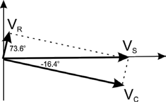

# ENPH 334 / PHYS 334 — Week 1 Problems: Solutions

> Solutions to [`ps01-week1-problems-dc-fundamentals.md`](ps01-week1-problems-dc-fundamentals.md).
>
> 🖼 **Circuit diagrams did not convert** (vector graphics) — keep
> `ps01-week1-problems-dc-fundamentals-solutions.pdf` open alongside. One figure *did* extract: the
> phasor diagram for Q5.
>
> ✅ **Every numerical result below was re-derived and checked** while filing; the arithmetic is
> sound. **Three unit slips in the original are flagged inline** — they are errors in the handout,
> not conversion artifacts, so the original values are kept and the correction noted beside them.

## 1. Ohm's law

$$R_T = R_1 + R_2 + R_3 \implies 12\ \text{k}\Omega = R_1 + 4\ \text{k}\Omega + 6\ \text{k}\Omega$$

$$\boxed{R_1 = 2\ \text{k}\Omega}$$

$$V_1 = I \times R_T = 6\ \text{mA} \times 12\ \text{k}\Omega = \boxed{72\ \text{V}}$$

## 2. Voltage divider rule

At point **b**: $\ R_{L3} \parallel R_3 = 20 \parallel 30 = 12$

At point **a**: $\ (R_2 + 12) \parallel R_{L2} = 32 \parallel 20 = 12.31$

Using the voltage divider rule:

$$V_a = 120\ \text{V} \times \frac{12.31}{12.31 + 10} = \boxed{66.21\ \text{V}}$$

$$V_b = 66.21\ \text{V} \times \frac{12}{12 + 20} = \boxed{24.83\ \text{V}}$$

$$I_{\text{Batt}} = \frac{V_1}{R_{L1}} + \frac{V_1}{10 + 12.31} = \boxed{11.38\ \text{mA}}$$

> ⚠️ **Unit slip in the original.** The handout writes these resistances as "$20\ \Omega$",
> "$30\ \Omega$", "$32\ \Omega$" and then "$= 12\ \text{k}\Omega$" in the same line, and gives the
> battery current as "**11.38 A**". The resistances are **kilohms** throughout (that is the only
> reading under which $120/20 + 120/22.31 = 11.38$ works out), so the current is **11.38 mA**, not
> 11.38 A. The numbers are right; the unit labels are not.

## 3. Kirchhoff's current law

$V_{RL1} = 72 - 12 = 60\ \text{V}$, since the ground is at the lower node of $(R_2, R_{L2}, R_{L1})$.

From KCL: $\ I_{R1} = 50\ \text{mA} - 20\ \text{mA} = 30\ \text{mA}$, and
$V_1 = 60 - 20 = 40\ \text{V}$ (since there are 20 V across $R_{L2}$):

$$R_1 = \frac{40\ \text{V}}{30\ \text{mA}} = \boxed{1.33\ \text{k}\Omega}$$

Again by KCL: $\ I_{R2} = 30\ \text{mA} - 10\ \text{mA} = 20\ \text{mA}$, and
$V_{R2} = 20\ \text{V}$:

$$R_2 = \frac{20\ \text{V}}{20\ \text{mA}} = \boxed{1\ \text{k}\Omega}$$

$I_{R3} = 50\ \text{mA}$ and $V_{R3} = 12\ \text{V}$:

$$R_3 = \frac{12\ \text{V}}{50\ \text{mA}} = \boxed{240\ \Omega}$$

Also $R_{L1} = 60\ \text{V} / 20\ \text{mA} = 3\ \text{k}\Omega$ and
$R_{L2} = 20\ \text{V} / 20\ \text{mA} = 1\ \text{k}\Omega$.

### Power dissipation, $P = I^2 R$

| Component | Value | Current | Power |
|---|---|---|---|
| $R_1$ | 1.33 kΩ | 30 mA | **1.197 W** |
| $R_2$ | 1 kΩ | 20 mA | 0.4 W |
| $R_3$ | 240 Ω | 50 mA | 0.6 W |
| $R_{L1}$ | 3 kΩ | 20 mA | **1.2 W** |
| $R_{L2}$ | 2 kΩ | 10 mA | 0.2 W |

> **Yes — 2 W resistors may be used, since the maximum power dissipated is 1.2 W in $R_{L1}$.**

> ⚠️ **Internal inconsistency in the original.** The power table lists $R_{L2}$ as **2 kΩ**, but two
> lines earlier the same solution computes $R_{L2} = 20\ \text{V} / 20\ \text{mA} = 1\ \text{k}\Omega$.
> At 1 kΩ and 10 mA the dissipation is 0.1 W, not 0.2 W. Either way it is nowhere near the limit, so
> the conclusion stands — but the two values cannot both be right.
>
> *(The original also writes "$R_{L2} = 20V = 20mA = 1 k\Omega$", where the first `=` should be `/`.)*

## 4. Thévenin, superposition

**Thévenin voltage — by superposition.**

Considering $E_1$ only, with $E_2$ shorted: $R_2 \parallel R_3 = 4\ \text{k}\Omega \parallel 6\ \text{k}\Omega = 2.4\ \text{k}\Omega$.
$R_4$ is "hanging" and can be ignored (no current flows through it into an open terminal).

$$E_{th1} = -6\ \text{V} \times \frac{2.4}{2.4 + 0.8} = -4.5\ \text{V}$$

Considering $E_2$ only, with $E_1$ shorted: $R_1 \parallel R_3 = 0.8\ \text{k}\Omega \parallel 6\ \text{k}\Omega = 0.706\ \text{k}\Omega$.

$$E_{th2} = 10\ \text{V} \times \frac{0.706}{0.706 + 4} = +1.5\ \text{V}$$

$$\boxed{E_{th} = -4.5 + 1.5 = -3\ \text{V}}$$

**Thévenin resistance.** Short both $E_1$ and $E_2$; then $R_1$, $R_2$ and $R_3$ are all in parallel:

$$R_1 \parallel R_2 \parallel R_3 = 0.8 \parallel 4 \parallel 6 = 0.6\ \text{k}\Omega$$

$$\boxed{R_{th} = 1.4\ \text{k}\Omega + 0.6\ \text{k}\Omega = 2\ \text{k}\Omega}$$

> 🔑 **Why $R_4$ is ignored for $E_{th}$ but included in $R_{th}$.** With terminals a–b open, no
> current flows through the series $R_4$, so it drops no voltage and cannot affect $E_{th}$. But
> when you kill the sources and look back into the terminals, $R_4$ is directly in the path, so it
> adds in series. This asymmetry is the single most common Thévenin mistake.

## 5. AC circuits

$$Z_T = R_1 + \frac{1}{j\omega C} = 470 - j1591.6\ \Omega = \boxed{1659.5\ \Omega\ \angle{-73.55°}}$$

$$e_{\text{rms}} = 20 \times 0.707 = 14.14\ \text{V (RMS)}$$

$$i = \frac{14.14\ \text{V}}{1659.5\ \Omega\ \angle{-73.55°}} = \boxed{8.52\ \text{mA}\ \angle{+73.55°}}$$

$$V_R = I \times R_1 = 8.52\ \text{mA} \angle{+73.55°} \times 470 = \boxed{4.004\ \text{V}\ \angle{+73.55°}}$$

$$V_C = I \times Z_C = 8.52\ \text{mA} \angle{+73.55°} \times (-j1591.6) = \boxed{13.56\ \text{V}\ \angle{-16.45°}}$$

since $-j = 1\angle{-90°}$.

*Check:* $\sqrt{4.004^2 + 13.56^2} = 14.14\ \text{V}$ ✓ — the two drops are in quadrature and sum
back to the source.

**The phasor diagram** (the one figure that extracted):

> 📝 The original writes the divisor as "$1659.5\ \Omega \angle 73.55°$" (positive) one line after
> defining $Z_T$ with $\angle{-73.55°}$. The minus sign is dropped in that one line; the answer that
> follows is computed correctly from the negative angle.

## 6. The R–C circuit

$$\tau = RC = (10 \times 10^3)(0.1 \times 10^{-6}) = 10^{-3}\ \text{s} = \boxed{1\ \text{ms}}$$

When $t = 0.5\tau$:

$$V_C = V_b\left(1 - e^{-0.5\tau/\tau}\right) = 5\left(1 - e^{-0.5}\right) = \boxed{1.967\ \text{V}}$$

Switch in position 2 (discharging), at $t = 0.2\ \text{ms}$:

$$i = \frac{V_b}{R}e^{-0.2/1.0} = \frac{5\ \text{V}}{10\ \text{k}\Omega}e^{-0.2} = \boxed{0.409\ \text{mA}}$$

## 7. Complex numbers

$$\frac{(6 + j5)(10 - j6)}{(4 - j3)(5 + j5)} = \frac{90 + j14}{35 + j5} = \boxed{2.576 + j0.032}$$

*Worked through: $(6+j5)(10-j6) = 60 + j14 + 30 = 90 + j14$; $(4-j3)(5+j5) = 20 + j5 + 15 = 35 + j5$;
multiply through by the conjugate $35 - j5$ over $35^2 + 5^2 = 1250$ to get $(3220 + j40)/1250$.*
