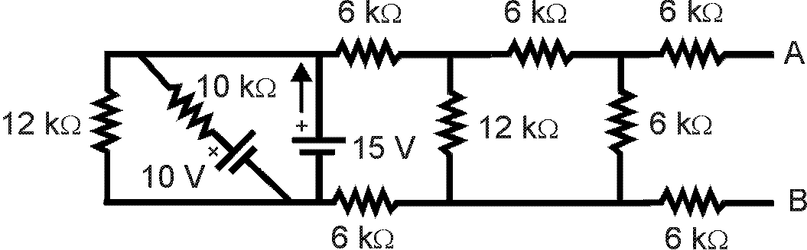
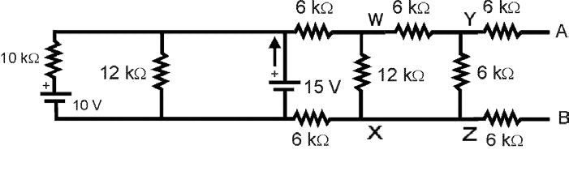

# ENPH 334 / PHYS 334 — Class Problems, Week 1: Solutions

> Solutions to
> [`ps02-week1-class-problems-thevenin-superposition.md`](ps02-week1-class-problems-thevenin-superposition.md).
>
> ⚠️ **Conversion fidelity.** The equations in this handout were set with a Word equation editor and
> come out of text extraction **with their characters in reversed order** — `48.32125.10` is
> `32.48` and `10.125` read backwards, interleaved. The mathematics below is therefore a
> **reconstruction**, not a mechanical extraction. **It was re-derived independently and every value
> checks out** (see the verification lines), but
> `ps02-week1-class-problems-thevenin-superposition-solutions.pdf` beside this note remains the
> authority.
>
> 🖼 Circuit diagrams are vector and did not extract; two figures did (the phasor diagrams for Q3).

## 1. Thévenin equivalent between A and B

Re-draw the circuit with the source on the left — the "normal" way.

**Thévenin voltage.** With terminals A–B open, no current flows in $R_3$, so it drops nothing and
the network is a simple divider of $V_1$ across $R_1$ and $R_2$:

$$V_{TH} = \frac{R_1}{R_1 + R_2}V_1 = \frac{6}{6 + 4}(8\ \text{V}) = \boxed{4.8\ \text{V}}$$

**Thévenin resistance.** Short $V_1$ (and hence $R_3$):

$$R_{TH} = 4\ \Omega \parallel 6\ \Omega = \boxed{2.4\ \Omega}$$

So the Thévenin circuit is a **4.8 V source in series with 2.4 Ω**, with $R_4 = 3\ \Omega$ then
reconnected across A–B if required.

## 2. Superposition

**First, short source $V_2$:**

$$R_2 \parallel R_3 = 6 \parallel 3 = 2\ \Omega$$
$$V_{R2} = \frac{2}{6 + 2} \times 5\ \text{V} = 1.25\ \text{V}$$

**Next, short $V_1$:**

$$R_1 \parallel R_2 = 6 \parallel 6 = 3\ \Omega$$
$$V_{R2} = \frac{3}{3 + 3} \times 3\ \text{V} = 1.5\ \text{V}$$

**Adding:**

$$\boxed{V_{R2} = 1.25 + 1.5 = 2.75\ \text{V}}$$

$$I_{R1} = \frac{5 - V_{R2}}{R_1} = \frac{2.25\ \text{V}}{6\ \Omega} = \boxed{0.375\ \text{A}} \quad \text{(left to right)}$$

> 🔑 **Note what gets shorted.** "Killing" a voltage source means replacing it with a **short**
> (0 V across it), not removing it. Killing a *current* source means an **open**. Getting this
> backwards is the standard superposition error.

## 3. Series R–C circuit — phasor solution

$R = 5\ \text{k}\Omega$, $C = 100\ \text{nF}$, $V_S = 12\ \text{V}$ at $500\ \text{Hz}$.

**Reactance of the capacitor:**

$$X_C = \frac{1}{\omega C} = \frac{1}{2\pi f C} = \frac{1}{2\pi (500)(100 \times 10^{-9})} = 3183\ \Omega \approx 3.18\ \text{k}\Omega$$

**Impedance:**

$$Z = R - jX_C = 5000 - j3183\ \Omega$$
$$|Z| = \sqrt{5000^2 + 3183^2} = 5927\ \Omega \approx 5.93\ \text{k}\Omega$$
$$\angle Z = -\arctan\!\left(\frac{3183}{5000}\right) = -32.48°$$

**Current:**

$$|I| = \frac{|V_S|}{|Z|} = \frac{12\ \text{V}}{5927\ \Omega} = \boxed{2.025\ \text{mA}} \approx 2\ \text{mA}$$

**Voltages across each element:**

$$V_R = I R = 2.025\ \text{mA} \times 5000\ \Omega = \boxed{10.125\ \text{V}}$$
$$V_C = I X_C = 2.025\ \text{mA} \times 3183\ \Omega = \boxed{6.446\ \text{V}}$$

*Verification:* $\sqrt{10.125^2 + 6.446^2} = 12.0\ \text{V}$ ✓ — $V_R$ and $V_C$ are in quadrature
and their phasor sum is the 12 V source, as it must be.

**Phase:**

$$\boxed{\text{the voltage lags the current by } 32.5°} \quad\text{(equivalently, the current leads the voltage by } 32.5°\text{)}$$

The handout gives an **alternative solution** that works the same result symbolically:
$V_R = I \times 5 \times 10^3$, $V_C = I \times 3.18 \times 10^3$, so
$|V| = I \times 5.93 \times 10^3$ at $\angle V = -32.5°$; setting $|V| = 12\ \text{V}$ gives
$I = 12/(5.93 \times 10^3) = 2\ \text{mA}$.

---

## Bonus: Week 2 — Thévenin reduction

> The solutions PDF carries a **third page headed "Week 2 Thevenin Reduction"** that has no
> counterpart in the week 1 problems file. It is a preview of the week 2 tutorial, kept here
> because it is where it was issued.

Redraw the circuit to make it clearer. For a Thévenin reduction at (A, B), **the circuit to the
left of the 15 V battery has no effect in this case**. Use **successive Thévenin reductions** on
small circuit blocks:

**1) Consider points (W, X):**

$$V_{th1} = V_{WX} = \frac{12\ \text{k}\Omega}{(12 + 6 + 6)\ \text{k}\Omega} \times 15\ \text{V} = 7.5\ \text{V}$$
$$R_{th1} \ \text{(short } V_1) = 12\ \text{k}\Omega \parallel (6+6)\ \text{k}\Omega = 6\ \text{k}\Omega$$

**2) Consider points (Y, Z):**

$$V_{th2} = V_{YZ} = \frac{6\ \text{k}\Omega}{(6 + 6 + 6)\ \text{k}\Omega} \times 7.5\ \text{V} = 2.5\ \text{V}$$
$$R_{th2} \ \text{(short } V_{th1}) = 6\ \text{k}\Omega \parallel (6+6)\ \text{k}\Omega = 4\ \text{k}\Omega$$

**3) Consider points (A, B):**

$$\boxed{V_{TH} = V_{AB} = V_{th2} = 2.5\ \text{V}}$$
$$\boxed{R_{TH} \ \text{(short } V_{th2}) = (6 + 4 + 6)\ \text{k}\Omega = 16\ \text{k}\Omega}$$

> 🔑 **The technique worth taking from this.** Rather than collapsing a ladder in one go, reduce it
> **one block at a time**, carrying $V_{th}$ and $R_{th}$ forward as the source for the next block.
> Each step is a two-resistor divider plus a parallel combination — arithmetic you can do without
> error — where the one-shot approach invites algebra mistakes. Expect this on Lab A1, which asks
> you to measure a Thévenin equivalent on the bench and compare it against the calculated value.
